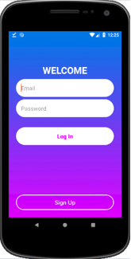
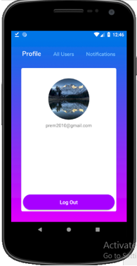

` Note: This app is in development mode`

# Firebase Cloud Messaging

Firebase Cloud Messaging (FCM) is a cross-platform messaging solution that lets you reliably deliver messages at no cost.

Using FCM, you can notify a client app that new email or other data is available to sync. You can send notification messages to drive user re-engagement and retention.
# Key Capabilities
* Send notification messages or data messages
* Versatile message targeting
* Send messages from client apps

# Screenshots

  
  
  
  

